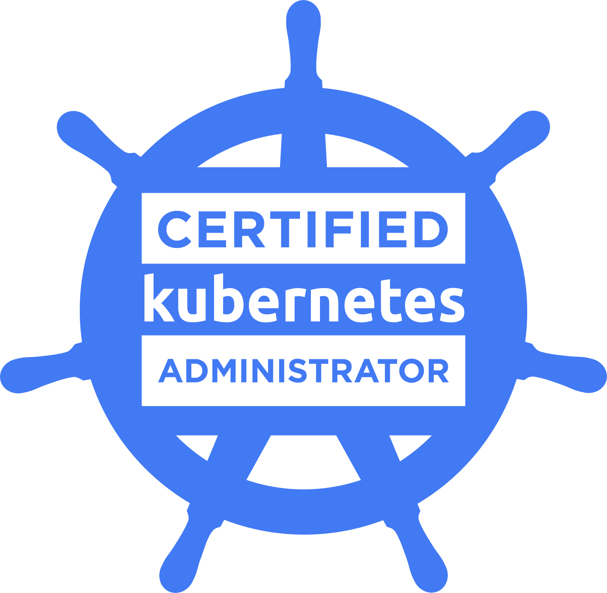
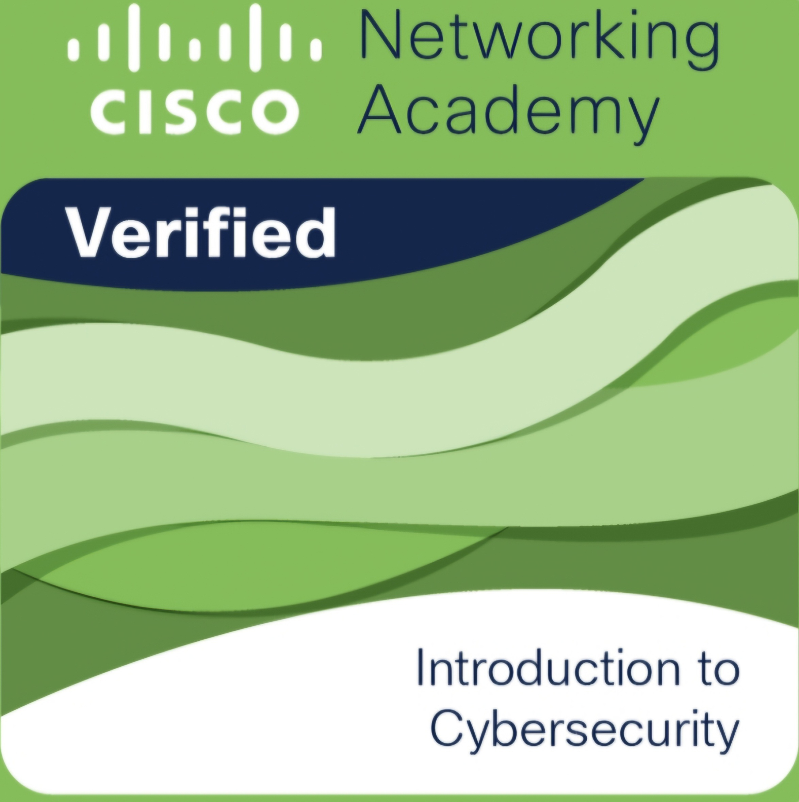

<h1 align="center">Hi 👋, I'm Amirhossein</h1>

<b>Platform Engineer · DevSecOps · AI Platform</b>

I build Kubernetes platforms with security baked in from day one, including the platform layer for LLM and RAG workloads.

---

### 🎯 Focus

- **Platform Engineering:** GitOps, self-service, sane defaults
- **AI Platform:** RAG, vector DBs, self-hosted model serving, LLM gateway, GPU-ready infra
- **DevSecOps:** shift-left scanning, admission control, runtime security
- **Supply Chain Security:** SBOMs, image signing, artifact verification
- **IaC:** Terraform-first, cost-conscious, reproducible

### 🚀 Featured Projects

| Project | Description |
|---|---|
| [**ai-platform-lab**](https://github.com/amirhosssein0/ai-platform-lab) | RAG platform on K3s: Argo CD, Qdrant, Vault, NetworkPolicies, CI to GHCR |
| [**jenkins-security-lab**](https://github.com/amirhosssein0/jenkins-security-lab) | Supply-chain pipeline: Kaniko, Syft, Trivy, Cosign, Kyverno, Falco |
| [**kafka-and-security-lab**](https://github.com/amirhosssein0/kafka-and-security-lab) | Event-driven Kafka + KEDA on AKS with a DevSecOps pipeline |
| [**k8s-operator-lab**](https://github.com/amirhosssein0/k8s-operator-lab) | Kubernetes Operator with CRD and reconciliation loop |
| [**vault-cicd-lab**](https://github.com/amirhosssein0/vault-cicd-lab) | Vault + GitHub Actions secrets management |
| [**observability-lab**](https://github.com/amirhosssein0/observability-lab) | Prometheus, Grafana, Loki, SLI/SLO on k3s via Terraform + Ansible |

### 🧰 Tech Stack

### 📜 Certifications

&nbsp;&nbsp;

